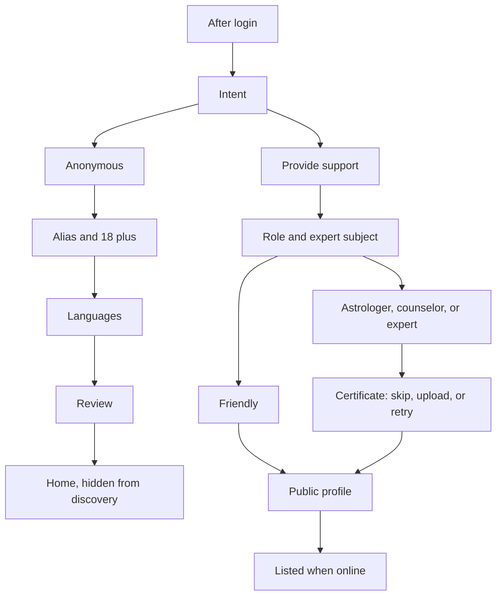
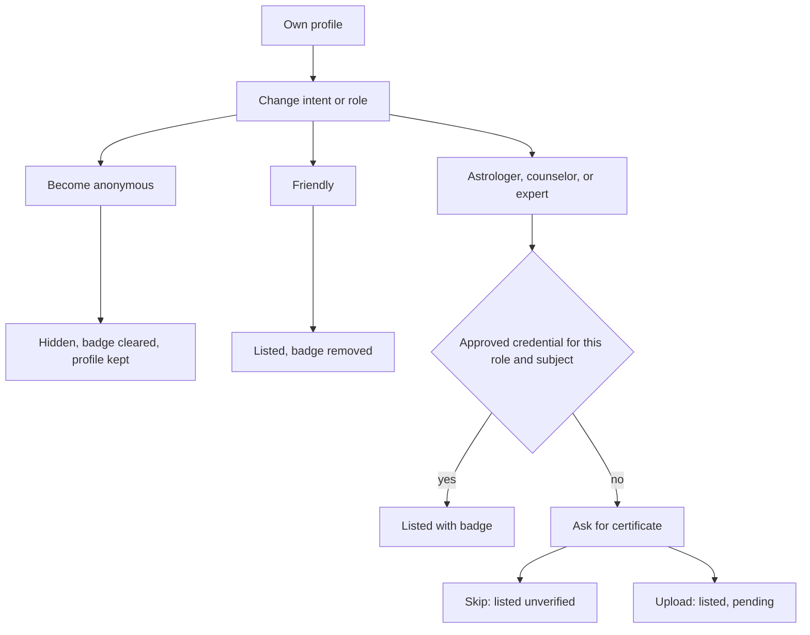

# Onboarding intent flow

Today every signed-in user is forced through one profile in `[app/src/navigation/RootNavigator.tsx](app/src/navigation/RootNavigator.tsx)` until `profile.complete` is true. Completion in `[backend/src/modules/profile/profile.completion.ts](backend/src/modules/profile/profile.completion.ts)` requires a name, date of birth, and primary photo, then `[profile.service.ts](backend/src/modules/profile/profile.service.ts)` sets `profile_status = 'active'`. Discovery in `[backend/src/modules/shell/people.routes.ts](backend/src/modules/shell/people.routes.ts)` already lists only `active` profiles. Gender is stored only on the device. Rates live in `acc.m_companion_rates` and are saved through the profile API, but they are not an onboarding step.

## Decisions locked for this slice

- One support role per account: friendly, astrologer, counselor, or expert. An expert must name the subject.
- An unverified astrologer, counselor, or expert is still listed in that category. The verified badge appears only when review status is `approved`.
- Uploading a certificate sets status to `pending`. Skipping sets `none`. Rejection keeps them listed and unverified, with a reason.
- Anonymous accounts finish onboarding without a public photo, interests, or rates. Completion stores `profile_status = 'hidden'` and does not create `acc.m_companion_profiles`.
- Accounts that are already `complete` become friendly providers and are not sent through onboarding again.
- A finished account can change intent or support role from their own profile. The public profile (photo, about, interests, languages, rates) is kept. Listing, badge, and certificate follow the new choice.

## Anonymous path

Screens: Intent, Basics, Languages, Review. Skip gender, location, photo, about, interests, and rates.

Basics still enforces 18+ through the existing date-of-birth check. The name field is the in-call alias, not a public listing name. Languages stay, because discovery already filters by interest and the call needs a language match. Location stays optional and can be set later from home; distance search already returns `LOCATION_REQUIRED` when it is missing.

`complete()` for this intent sets `profile_status = 'hidden'` and `step = 'complete'`. Discovery and the person-detail query keep requiring `active`, and both queries also exclude `account_intent = 'anonymous'` so a status mistake cannot list them. They can open the home shell, recharge, and contact listed people. Wallet behavior stays as it is.

## Provider path

Screens: Intent, Role, then Certificate only for astrologer, counselor, and expert, then the current public steps: Basics, Gender, Location, Photo, About, Interests, Languages, a new Rates step, Review.

- Friendly skips the certificate screen.
- Certificate actions are explicit: upload, or "Continue without verification". A failed upload stays on the screen.
- Counselor role shows one line that this is support, not emergency care.
- Expert subject is required before continuing.
- Photo and at least one of chat, audio, or video rate are required before `complete()`. Completion sets `profile_status = 'active'`.
- The certificate file is private. It is not written to `acc.m_profile_media` and is not served by the public photo route.

## Changing intent or role

Entry point is the user's own profile, after onboarding. The same `PUT /v1/profile/intent` and `PUT /v1/profile/role` endpoints apply. Side effects live in the profile service, so a client cannot leave a badge on the wrong role.

Provider role change (friendly, astrologer, counselor, expert), while staying a provider:

- The new role is saved immediately and they stay in the app. Onboarding does not restart.
- Photo, about, interests, languages, and rates stay.
- Friendly clears `expert_subject` and does not ask for a certificate. Any badge is removed.
- Astrologer, counselor, or expert opens the certificate step. Skip leaves them listed in the new category as unverified. Upload sets `pending`.
- Expert requires a subject. Changing only the subject is treated as a role change.
- A credential is stored with its role and subject. Switching back to a role and subject that already has an `approved` credential restores the badge. Any other change sets verification to `none`, clears the note, and keeps the old file only as history.

Provider to anonymous:

- Set intent to `anonymous`, clear role, subject, and verification, set `profile_status = 'hidden'`, and mark the companion profile offline.
- Keep the saved photo, interests, and rates so a later switch back does not collect them again.
- They stay `complete` when name and date of birth already exist, and land in the home shell instead of onboarding.
- Person detail and the public photo route return 404. The photo route does not check `profile_status` today, so that check is part of this change.
- Confirm in the UI that they will disappear from the list. The display name remains the in-call alias.

Anonymous to provider:

- Save the chosen role, then ask for a certificate when the role is not friendly.
- If a primary photo and at least one rate are already saved, set `profile_status = 'active'` and stay in the app.
- If either is missing, set the step to the first missing provider screen (photo, then rates) and mark the profile incomplete so `[ProfileGate](app/src/navigation/RootNavigator.tsx)` resumes onboarding there. Alias and date of birth are kept.

## Data and API

Add `database/migrations/019_onboarding_intent.sql`:

- `acc.m_profiles.account_intent` `anonymous | provider`
- `support_role` `friendly | astrologer | counselor | expert`, null for anonymous
- `expert_subject` text, required only for expert
- `verification_status` `none | pending | approved | rejected`
- `verification_note` text
- Widen `onboarding_step` to include `intent`, `role`, `certificate`, and `rates`
- New `acc.m_support_credentials` for the private file key, content type, role, expert subject, and status. Reuse the existing media storage adapter, not the public photo table. Older rows stay when the role changes so an approved match can restore the badge.

Existing `complete` rows get `account_intent = 'provider'`, `support_role = 'friendly'`, `verification_status = 'none'`. New profiles start at step `intent`.

Extend profile types, validation, repository, service, and routes:

- `PUT /v1/profile/intent`
- `PUT /v1/profile/role` during onboarding and after completion. Applies the badge and listing rules in Changing intent or role.
- `POST /v1/profile/credential` and `DELETE` for replace
- `POST /v1/profile/credential/skip`
- `POST /v1/profile/credential/review` sets `approved` or `rejected` for a later review tool. This slice does not add an admin UI.
- `complete()` branches on intent, as above.

Public person payloads from `[people.routes.ts](backend/src/modules/shell/people.routes.ts)` gain `supportRole`, `expertSubject`, and `verified`. `verified` is true only when `verification_status = 'approved'`.

## App

Update `[app/src/features/profile/types.ts](app/src/features/profile/types.ts)`, `[navigation.ts](app/src/features/profile/navigation.ts)`, `[OnboardingNavigator.tsx](app/src/features/profile/OnboardingNavigator.tsx)`, and `[OnboardingFrame.tsx](app/src/features/profile/components/OnboardingFrame.tsx)` so `routeForStep` resumes the right screen.

New screens: `IntentScreen`, `RoleScreen`, `CertificateScreen`, `RatesScreen`. Basics copy changes to "alias" on the anonymous path. `[profile.service.ts](app/src/features/profile/services/profile.service.ts)` gains the new calls.

Show the role label and verified badge on the discovery cards and person screen. On the user's own profile, show the current intent, role, and verification status. From there they can change intent or role, upload again when status is `none`, `pending`, or `rejected`, and confirm before becoming anonymous. A role change that still needs a photo, rate, or certificate reuses those onboarding screens instead of a second form.

Anonymous users still reach `MainShell` once `complete` is true. No photo, interest, or rate prompt is added there.

## Tests

- Backend: anonymous complete stays `hidden` and is absent from `/people/online`, person detail, and the public photo route. Provider without a photo or rate cannot complete. Skip leaves `verification_status = none`. Upload leaves `pending` and does not expose the file on the public photo route. Review approval flips `verified` on the public card.
- Role change: friendly to astrologer clears the badge and lists the new role. Returning to a role and subject with an approved credential restores it. Provider to anonymous hides the profile and returns 404 for the public photo. Anonymous to provider with a saved photo and rate becomes `active`. Anonymous to provider missing a photo resumes at that step and stays unlisted.
- App: incomplete profile opens Intent. Anonymous route skips photo and interests. Professional route stops on a failed upload and continues when the user chooses to skip. Existing `complete` fixtures still open home. Own profile can change role without restarting onboarding when the public profile is already complete.

